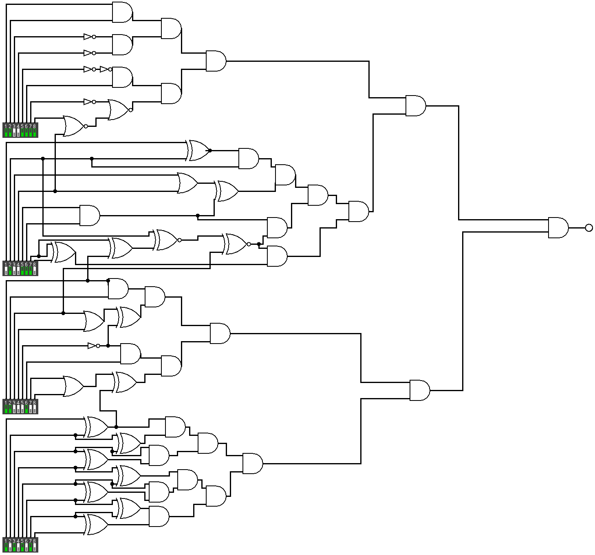

## Opis

Zadanie było najzwyczajniejszym przykładem bramek logicznych. Istniało wiele
możliwości wykonania go: od ręcznego rysowania diagramu, przez użycie symulatorów bramek logicznych, aż po zastosowanie
zaawansowanych narzędzi takich jak [Z3](https://en.wikipedia.org/wiki/Z3_Theorem_Prover).

## Rozwiązanie

Po rozwiązaniu zadania otrzymywaliśmy ciąg:

`11001111 01001110 11000100 10101010`

Co odpowiadało fladze:

`hack4KrakCTF{Rt1Lc6Tk9T-Rt6Lc3Qm0B-pH1Qk6Zv8N-vN3Zv7Hp0K}`
